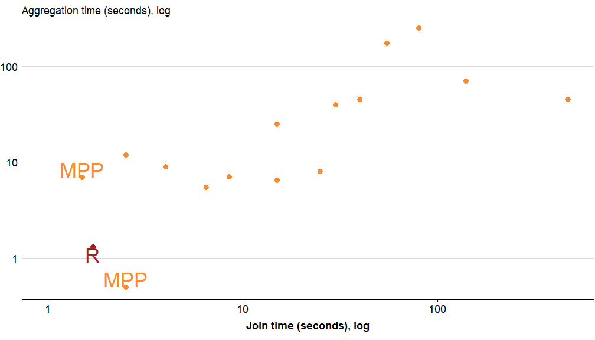

Treasury-COP
========================================================
author: Hugh Parsonage
date: 2017-11-02
width: 1440
height: 900

Use of R at Grattan
========================================================

* Tax modelling
* Survey analysis
* Drawing charts

Why should you use it?
========================================================

* Deep pool of 

Why should you use it?
========================================================

Leader in performance:

** Some performance metrics
*** CRIMpp performs 100,000 times faster than Excel models
-- enables cameo models to be performed on populations
** Unit tests
** Good plotting interaction
** Strengthens defences against modelling. 
*** Greater transparency 
-- to the public 
-- more importantly, to yourself

** grattan package
*** performant and extensible tax scales
*** usual inflators

** ASGS package
*** Neat interface with interactive plots

** PSMA package
*** geocoding

** Census2016.DataPack

A typical workflow:
- Work out what data is useful
- Create a data package
- Create an auxiliary package for common idioms throughout the project
-- e.g. 

