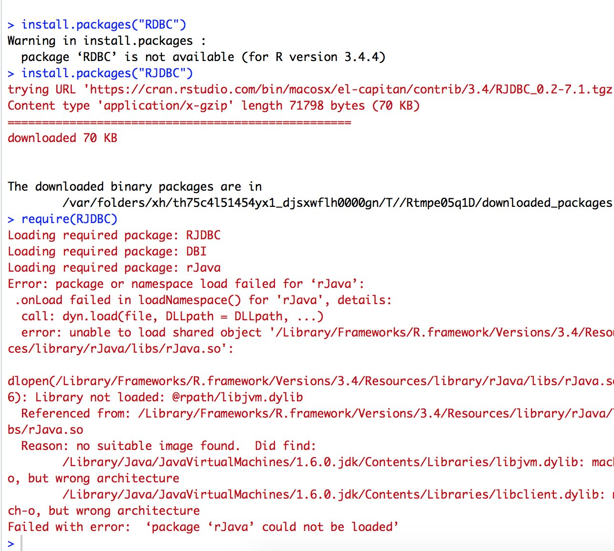

numbat
========================================================
author: Hugh Parsonage
date: 2018-05-30
width: 1440
height: 900
transition: none


Grattan
========================================================

* My R packages
* How they're used at Grattan
  - grattan
  - grattex
  
* Surprises 

My R packages
========================================================

Author in:

* `ASGS` (via `ASGS.foyer`)
* `PSMA`
* `hutils`
* `grattan`
* `grattanReporter`
* `TeXCheckR`
* `bomrang`
* `nsw.property.prices`


`ASGS`
========================================================

Big package (1 GB):

* Houses 2011-2016 shapefiles: SA[1-4], postcodes, LGAs, destination zones, states, as well as simplified/lighter versions for the web etc
* `grattan_leaflet()` produces interactive maps of a table of location vs variable in Grattan palette
* Functions for converting lat-lons to the statistical area containing it.

PSMA
========================================================

address ---> lat-lon:


```r
library(PSMA)
geocode(number_first = 20,
        street_name = "Chancellors", 
        street_type = "Walk",
        postcode = 3168)
```

```
   ordering  LATITUDE LONGITUDE
1:        1 -37.91138  145.1408
```

First query in a session takes a few seconds (to load the lookup tables).
Doesn't take much longer to do a few million addresses.

PSMA
========================================================
transition: none
address <--- lat-lon:


```r
library(PSMA)
revgeocode(-37.80058, 144.9618)
```

```
      distance ordering NUMBER_FIRST STREET_NAME STREET_TYPE_CODE POSTCODE
1: 0.002640044        1           10     MALVINA            PLACE     3053
   order BUILDING_NAME LOT_NUMBER FLAT_NUMBER ADDRESS_DETAIL_INTRNL_ID
1:     1          <NA>       <NA>          NA                  9393231
```


`hutils`
========================================================

Not very interesting, but I do like


```r
iris[iris$Species  %in% c("setosa", "versicolour"), ]
## Not run: 
# Error:
iris[iris$Species %ein% c("setosa", "versicolour"), ]
```

(also lightweight and faster versions of `if_else` and `coalesce`).


Grattan Institute
========================================================

Think-tank at the University of Melbourne. We received a \$30M 
endowment in 2008 and have about 25 staff.


# How we use R
========================================================


# How we use R
========================================================

* Data cleaning
* A few packages for common tasks
* Plotting


How we use R: Data-cleaning
========================================================

* Lots of bespoke data access
* We take what we can get
* Data dictionary decoding

How we use R: packages
========================================================


```r
library(grattan)
```

How we use R: common tasks
========================================================


```r
library(grattan)
```

Version 1.6.0.0 on CRAN with the Budget 2018 modelling.
(Minor version updates every Budget.)


How we use R: common tasks
========================================================

At its core:


```r
income_tax(50e3, "2013-14")
```

```
[1] 8297
```

Changed a bit since early 2015:

https://github.com/HughParsonage/grattan/compare/fe895144906af7cc50983723baba84dac06e8600...master


How we use R: common tasks
========================================================


```r
cpi_inflator(100, from_fy = "2003-04", to_fy = "2017-18")
```

```
[1] 140.399
```

```r
wage_inflator(100, from_fy = "2003-04", to_fy = "2017-18")
```

```
[1] 154.8527
```

```r
lf_inflator_fy(100, from_fy = "2003-04", to_fy = "2017-18")
```

```
[1] 131.4298
```


How we use R: common tasks
========================================================


```r
library(taxstats1516)
sample_file_1516 %>% 
  project_to("2018-19") %>%
  model_sample_file(medicare_levy_rate = 0.025) %>%
  revenue_foregone
#> $4.1 billion
```


How we use R
========================================================


```r
library(grattan)
model_income_tax(sample_file,
                 "2017-18",
                 lito_max_offset = 500)
```

Getting competitive with Government modelling. And faster:


|        |    t/s|  models|
|:-------|------:|-------:|
|Grattan |    0.3| 170.000|
|Govt    | 1020.0|   0.059|

|        |    t/s|  models|
|:-------|------:|-------:|
|Grattan |    0.3| 170.000|
|Govt    | 1020.0|   0.059|


Moving to LaTeX
========================================================

Grattan uses LaTeX for its reports (via ShareLaTeX).
Occasionally we use `knitr` if it makes sense.


Surprises
========================================================

1. LaTeX produced uncontroversionally better output -- even though it was designed to be a replica of Word's output.


Surprises
========================================================

1. LaTeX produced uncontroversionally better output -- even though it was designed to be a replica of Word's output.
2. LaTeX is really easy.


Surprises
========================================================

1. LaTeX produced uncontroversionally better output -- even though it was designed to be a replica of Word's output.
2. LaTeX is really easy.
3. LaTeX and R are difficult in ways we don't think about


Installing things is hard
========================================================




