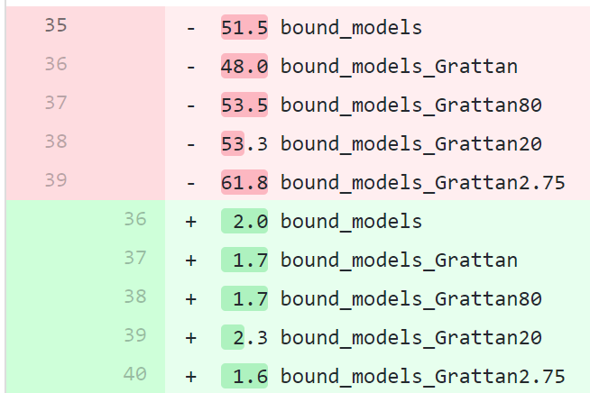

## Why care about performance

- Ask more questions
- Ask questions of more data
- Provide answers faster
- Fewer 'interruptions': the difference between a runtime of one second and one minute is *much* more than 59 seconds. 


##  The Golden Rules of Improving Performance
<style type="text/css">
  .reveal p {
    text-align: left;
  }
  .reveal ul {
    display: block;
  }
  .reveal ol {
    display: block;
  }  
</style>


1. **Don't guess**
2. **Don't waste time saving time**
3. **Don't be wrong**

## Don't guess

**Measure** your code before you start.

**Measure** your improvement.

## Don't waste time saving time

Set a **benchmark** for your execution time, e.g. "I want this function to execute in less than 1 second"

**Stop tinkering** when you hit your benchmark


## Don't be wrong

Fixation on improving run times *often* comes at the expense of correctness. 

Don't start tinkering till you have unit tests!

##

Some less moralistic rules...

##  The Silver Rule of Performance


##  The Silver Rule of Performance


The key to improving performance is very simple.

> - Suppose $f(x)$ is some computation that takes a long time to run. 

> - To make $f(x)$ faster, take the following steps:

<br>

> 1. Already know that $f(x) = y$.

> 2. Return $y$.

##  The Silver Rule of Performance


More formally, we can use:

* *Caching*
* *Memoization*
* or just general knowledge

##  The Silver Rule of Performance: caching


**cache**: A store of things that may be required in the future, which can be retrieved rapidly.

##  The Silver Rule of Performance: caching


**cache**: A store of things that may be required in the future, which can be retrieved rapidly.

Strategy:

1. When you first complete a computationally intensive script, save it to disk
2. When you next need the result, simply load it from disk


##  The Silver Rule of Performance: caching


**cache**: A store of things that may be required in the future, which can be retrieved rapidly.

For example, Budget modelling with a host of parameters:

```r
x.fst <- sprintf("budget-2018_cache/%s.fst", chunk)
if (file.exists(x.fst) && .cache) {
  read_fst(x.fst, as.data.table = TRUE)
} else {
  Budget_1922 <- lapply(unique_fy_year, model_Budgets, ...)
  ### ...
```

##  The Silver Rule of Performance: caching


**cache**: A store of things that may be required in the future, which can be retrieved rapidly.

For example, Budget modelling with a host of parameters:



Cuts a 4:40 script to 0:40!

##  The Silver Rule of Performance: caching


**Advantages:**

* Nice and *dumb*: doesn't require much thought or work
* Works on any type of data structure
* Can cut huge computations down

**Disadvantages**

* Cache invalidation is one of the hardest unsolved theoretical problems
* Doesn't help the first computation (in fact it makes it slower)
* Not so good on small computations


##  The Silver Rule of Performance: caching


Some advice to minimize the disadvantages:

1. **Be conservative with respect to cache invalidation**.
<br>
    - Clean cache at least nightly
<br>
    - When in doubt, clean
  
2. Limit to large computations (such as data.frames)
<br>

3. Use `fst` package.


##  The Silver Rule of Performance


Even if haven't already saved the result to disk (or if caching would otherwise not be advantageous), you'd be surprised how much you might already know.


##  Example: minimum


$\min(\mathbf{v})$ is typically slow when $\mathbf{v}$ is large.

Out-of-the-box, there is no way to avoid this algorithm:

1. Reserve a number $y = 0$.
<br>
2. For every element $x_i$ in $\mathbf{v}$, compare it to $y$:

   &emsp; If it's smaller, set $y = x_i$

3. Return $y$

So if $\mathbf{x}$ has a billion elements, you have to make at least billion comparisons.


##  Example: minimum


But if you already know that $\mathbf{v}$:

1. is **constant**---you can just return the first element.

2. is **sorted** in ascending order---you can just return the first element.

3. is a date in 2018---you can stop once you see January 1st.


##  Example: minimum


```r
  options(digits = 2)
  options(scipen = 99)
library(microbenchmark)  
fmin <- function(x) {
  if (is.unsorted(x)) {
    min(x)
  } else {
    x[1]
  }
}
microbenchmark( min(1:1e8), 
               fmin(1:1e8), unit = "us")
#> Unit: microseconds
#>               expr   min    lq  mean median    uq   max
#>   min(1:100000000) 82856 85749 85835  85846 85959 88516
#>  fmin(1:100000000)     0     1    32      8    14  2295
```

##  Example: finding constant columns


Suppose you want to model some variable against all other variables in a data frame. Fewer variables is faster, and constant columns will cause problems. How can we detect whether a column is constant?

N.B. if you have a 100,000,001 row dataset, checking the first 100 million values is not enough.


##  Example: finding constant columns

What if you already know that 50 of your variables are dummy variables?


##  Example: finding constant columns

What if you already know that 50 of your variables are dummy variables?

Result:

```r
Unit: microseconds
             expr     min      lq    mean  median      uq  
       uniqueN(x) 1322394 1323161 1327459 1327343 1327712
 any(x) + !all(x)       0       1       7       1       7
```


##  Example: finding constant columns


##  Memoization


Remind functions of previous inputs.

```
                   PIN BENPAID FEECHARGED SCHEDFEE BILLTYPECD   YOS MOS
        1:        7603    3280       3280     3280          D  2007  12
        2:        7603     820        820      960          D  2007  12
        3:        7603   21680      24200    13630          P  2007  10
        4:        7603    5800       5800     6820          P  2007  10
        5:        7603     820        820      960          D  2008   6
       ---                                                                         
765031260: 10000000744     340        340      400          D  2014  12
765031261: 10000000744     510        510      595          D  2014  12
765031262: 10000000744    3225       3225     3790          D  2014  12
765031263: 10000000744    2010       2010     2360          D  2014  12
765031264: 10000000744    2010       2010     2360          D  2014  12
```


##  Memoization

What's the real (CPI-inflated) value of `BENPAID`?

```{r, eval=FALSE}
cpi_inflator(BENPAID, from_fy = yr2fy(YOS), to = "2015-16")
# process    real 
#   12.8m   12.8m 
```

Too slow!

##  Memoization

Calculating the CPI inflator is relatively simple:
```{r, eval=F}
cpi_inflator(from = "1949-50", to = "1951-51")`
```

<br>


|fy_year | obsValue|
|:-------|--------:|
|1948-49 |      3.9|
|1949-50 |      4.2|
|1950-51 |      4.8|
|1951-52 |      5.9|
|1952-53 |      6.3|

##  Memoization

Calculating the CPI inflator is relatively simple:
```{r, eval=F}
cpi_inflator(from = "1949-50", to = "1951-51")`
```

Find the time


|fy_year | obsValue|
|:-------|--------:|
|1948-49 |      3.9|
|1949-50 |      4.2|
|1950-51 |      4.8|
|<span style="color: red;" >1951-52 </span> |      5.9|
|1952-53 |      6.3|


```{r, eval=FALSE}
          match(to, fy_year)] 
  
#
```

##  Memoization

Calculating the CPI inflator is relatively simple:
```{r, eval=F}
cpi_inflator(from = "1949-50", to = "1951-51")`
```

Find the time, match the value


|fy_year | obsValue|
|:-------|--------:|
|1948-49 |      3.9|
|1949-50 |     4.2 |
|1950-51 |      4.8|
|1951-52 |    <span style="color: red;" >   5.9 </span>|
|1952-53 |      6.3|


```{r, eval=FALSE}
obsValue[ match(to, fy_year)] 

#
```


##  Memoization

Calculating the CPI inflator is relatively simple:
```{r, eval=F}
cpi_inflator(from = "1949-50", to = "1951-51")`
```

Find the time, match the value, find the time, 

|fy_year | obsValue|
|:-------|--------:|
|1948-49 |      3.9|
|<span style="color: red;" >1949-50 </span> |      4.2|
|1950-51 |      4.8|
|1951-52  |      5.9|
|1952-53 |      6.3|

```{r, eval=FALSE}
obsValue[ match(to, fy_year)]   
            match(from, fy_year)
#
```


##  Memoization

Calculating the CPI inflator is relatively simple:
```{r, eval=F}
cpi_inflator(from = "1949-50", to = "1951-51")`
```

Find the time, match the value, find the time, match the value


|fy_year | obsValue|
|:-------|--------:|
|1948-49 |      3.9|
|1949-50 |     <span style="color: red;" > 4.2 </span>|
|1950-51 |      4.8|
|1951-52 |      5.9|
|1952-53 |      6.3|


```{r, eval=FALSE}
obsValue[ match(to, fy_year)] 
  obsValue[ match(from, fy_year)]
#
```


##  Memoization

Calculating the CPI inflator is relatively simple:
```{r, eval=F}
cpi_inflator(from = "1949-50", to = "1951-51")`
```

Find the time, match the value, find the time, match the value, divide


|fy_year | obsValue|
|:-------|--------:|
|1948-49 |      3.9|
|1949-50 |      4.2 |
|1950-51 |      4.8|
|1951-52 |      5.9|
|1952-53 |      6.3|


```{r, eval=FALSE}
obsValue[ match(to, fy_year)] / 
  obsValue[ match(from, fy_year)]
#
```


##  Memoization

Calculating the CPI inflator is relatively simple:
```{r, eval=F}
cpi_inflator(from = "1949-50", to = "1951-51")`
```

Find the time, match the value, find the time, match the value, divide, fast


|fy_year | obsValue|
|:-------|--------:|
|1948-49 |      3.9|
|1949-50 |      4.2 |
|1950-51 |      4.8|
|1951-52 |      5.9|
|1952-53 |      6.3|


```{r, eval=FALSE}
obsValue[fmatch(to, fy_year)] / 
  obsValue[fmatch(from, fy_year)]
#
```

## So what's the problem?


## So what's the problem?

Remember the golden rule:

- **Don't be wrong**


## So what's the problem?

Remember the golden rule:

- **Don't be wrong**

- aka. be safe out there

```{r, eval=F}
grattan::cpi_inflator(from_fy = "1949-50", to_fy = "1951-52")
#> 
#> Error: `from_fy = "1949-50"` which is earlier than the
#> first instance of the seasonally adjusted CPI: "1986-87".
```


## Don't be wrong

The `grattan` package's `cpi_inflator` is about 400 lines of code. Only 5 actually calculate the inflator.

There's more to do:

 > - check the inputs for validity  
 > - make forecasts as required
 > - check the ABS for updates
 > - handle mismatching lengths, missing values


## Memoization


```{r, eval=FALSE}
# 1.6.4.0          2018-08-19

# process    real 
#   17.2s   17.2s 
```

##  Memoization

```{r, eval=FALSE}
library(data.table)
MBS[, realBft := cpi_inflator(BENPAID,
                              from_fy = yr2fy(YOS),
                              to = "2015-16")
    ]
## > about an hour

MBS[, realBft := cpi_inflator(BENPAID,
                              from_fy = yr2fy(.BY[[1]]),
                              to = "2015-16"),
    by = "YOS"]
# 30 s

```


##

What else might we know?


## What are computers good for?

- Computers are good at computations of a *medium* size.

  - An eight-year-old can probably evaluate `5 + 5` faster than (someone using) a computer can.
  

## What are computers good for?

If a computation is less than a "medium" size, consider evaluating it directly.

Medium means: `length(x) > 1`. 


## Even for hard problems, you probably already know "small" cases

- What's the inverse of a $1 \times 1$ matrix?
 
- Solve the Travelling Salesman Problem for two cities

- What are the prime factors of 2?

Bonus: considering 'dumb' corner cases makes your functions more robust


## 

And even if you or your computer don't already know, someone else might!

See the `HighPerformanceComputing` entry on CRAN Taskviews


## C++

And if you get really stuck, consider using `Rcpp` to use a lower-level language.

It's common to see speeds increase by > 10,000-fold, 

e.g.
```r
bench::system_time(age_pension())
#> 10 microseconds (down from 1 second)
```


## Miscellany R results

Use `.Primitive` functions

`min(x) > a` is generally faster than `any(x > a)`

`grep(..., perl = TRUE)` is often faster than with `fixed = TRUE`


