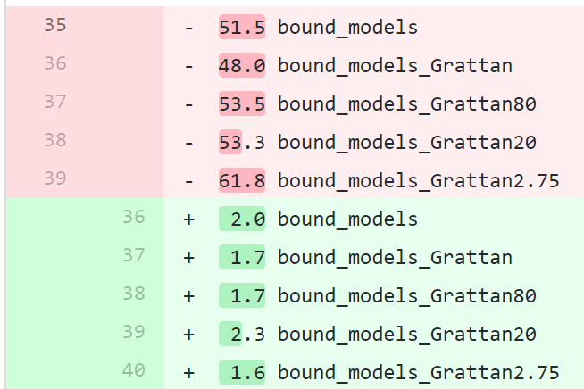
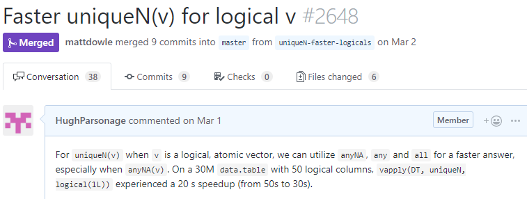

<style>
.small-code pre code {
  <!-- margin-left: -5em; -->
  font-size: 1.5em;
}
</style>

high-performance
========================================================
author: Hugh Parsonage
date: 2018-05-30
width: 1440
height: 900
transition: none
output: revealjs::revealjs_presentation


Why care about performance
========================================================

* Ask more questions
* Ask questions of more data
* Provide answers faster
* Fewer 'interruptions': the difference between a runtime of one second and one minute is *much* more than 59 seconds. 


The Golden Rules of Improving Performance
========================================================

1. **Measure**
2. 

The Silver Rule of Performance
========================================================

The key to improving performance is very simple.

Suppose $f(x)$ is some computation that takes a long time to run. 

To make $f(x)$ faster, take the following steps:

1. Already know that $f(x) = y$.
2. Return $y$.

The Silver Rule of Performance
========================================================

More formally, we can use:

* *Caching*
* *Memoization*
* or just general knowledge

The Silver Rule of Performance: caching
========================================================

**cache**: A store of things that may be required in the future, which can be retrieved rapidly.

Strategy:
 1. When you first complete a computationally intensive script, save it to disk
 2. When you next need the result, simply load it from disk


The Silver Rule of Performance: caching
========================================================

**cache**: A store of things that may be required in the future, which can be retrieved rapidly.

For example, Budget modelling with a host of parameters:

```r
if (file.exists(x.fst <- sprintf("budget-2018_cache/%s.fst", chunk)) && .cache) {
  read_fst(x.fst, as.data.table = TRUE)
} else {
  Budget_1922 <- lapply(unique_fy_year, model_Budgets, ...)
  ### ...
```

The Silver Rule of Performance: caching
========================================================

**cache**: A store of things that may be required in the future, which can be retrieved rapidly.

For example, Budget modelling with a host of parameters:



Cuts a 4:40 script to 0:40!

The Silver Rule of Performance: caching
========================================================

**Advantages:**

* Nice and *dumb*: doesn't require much thought or work
* Works on any type of data structure
* Can cut huge computations down

**Disadvantages**

* Cache invalidation is one of the hardest unsolved theoretical problems
* Doesn't help the first computation (in fact it makes it slower)
* Not so good on small computations


The Silver Rule of Performance: caching
========================================================

Some advice to minimize the disadvantages:

1. **Be conservative with respect to cache invalidation**.
  * Clean cache at least nightly
  * When in doubt, clean
2. Limit to large computations (such as data.frames)
3. Use `fst` package.


The Silver Rule of Performance
========================================================

Even if haven't already saved the result to disk (or if caching would otherwise not be advantageous), you'd be surprised how much you might already know.


Example: minimum
========================================================

$\min(\mathbf{v})$ is typically slow when $\mathbf{v}$ is large.

Out-of-the-box, there is no way to avoid this algorithm:

1. Reserve a number $y = 0$.
2. For every element $x_i$ in $\mathbf{v}$, compare it to $y$:
  a. If it's smaller, set $y = x_i$
3. Return $y$

So if $\mathbf{x}$ has a billion elements, you have to make at least billion comparisons.


Example: minimum
========================================================

But if you already know that $\mathbf{v}$:

1. is constant---you can just return the first element.
2. is *sorted* in ascending order---you can just return the first element.
3. is a date in 2018---you can stop once you see January 1st.


Example: minimum
========================================================

```r
  options(digits = 2)
  options(scipen = 99)
library(microbenchmark)  
fmin <- function(x) {
  if (is.unsorted(x)) {
    min(x)
  } else {
    x[1]
  }
}
microbenchmark( min(1:1e8), 
               fmin(1:1e8), unit = "us")
#> Unit: microseconds
#>               expr   min    lq  mean median    uq   max
#>   min(1:100000000) 82856 85749 85835  85846 85959 88516
#>  fmin(1:100000000)     0     1    32      8    14  2295
```

Example: finding constant columns
========================================================

Suppose you want to model some variable against all other variables in a data frame. Fewer variables is faster, and constant columns will cause problems. How can we detect whether a column is constant?

N.B. if you have a 100,000,001 row dataset, checking the first 100 million values is not enough.

But you may already know that 50 of your variables are dummy variables. 

Result:

```r
Unit: microseconds
             expr     min      lq    mean  median      uq  
       uniqueN(x) 1322394 1323161 1327459 1327343 1327712
 any(x) + !all(x)       0       1       7       1       7
```


Example: finding constant columns
========================================================




# Memoization
========================================================

Remind functions of previous inputs.

```
                   PIN BENPAID FEECHARGED SCHEDFEE BILLTYPECD   YOS MOS
        1:        7603    3280       3280     3280          D  2007  12
        2:        7603     820        820      960          D  2007  12
        3:        7603   21680      24200    13630          P  2007  10
        4:        7603    5800       5800     6820          P  2007  10
        5:        7603     820        820      960          D  2008   6
       ---                                                                         
765031260: 10000000744     340        340      400          D  2014  12
765031261: 10000000744     510        510      595          D  2014  12
765031262: 10000000744    3225       3225     3790          D  2014  12
765031263: 10000000744    2010       2010     2360          D  2014  12
765031264: 10000000744    2010       2010     2360          D  2014  12
```


# Memoization
========================================================

```
1.6.0.0          2018-05-19
.cpi (1bn)
process    real 
  12.8m   12.8m 

 Reinstall: ...Last change: NAMESPACE at 2018-08-19 23:08:28 (1 hours ago).
1.6.4.0          2018-08-19
cpi
from_fys (1bn):
process    real 
  17.2s   17.2s 
```

# Memoization
========================================================
class: small-code


```r
library(data.table)
MBS[, realBft := cpi_inflator(BENPAID, from_fy = yr2fy(YOS), to = "2015-16")]
## > about an hour
MBS[, realBft := cpi_inflator(BENPAID, from_fy = yr2fy(.BY[[1]], to = "2015-16")), by = "YOS"]
# 30 s
```


