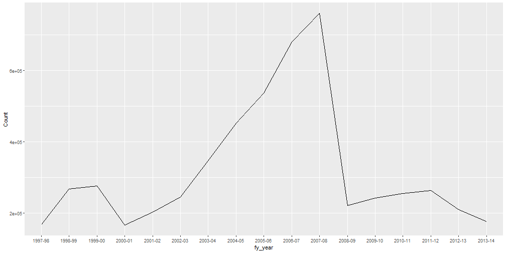

r-pkgs
========================================================
author: Hugh Parsonage
date: 2017-10-24
width: 1440
height: 900


R packages
========================================================
Why packages?

* Iterating is hard
* Copying and pasting is a lot more difficult than you might think
* Packages are fast and portable
* Packages force best practice:
    * unit test suites
    * documentation of datasets and functions
    
Types of packages
========================================================

Data packages:
* `taxstats`
* `sih.hilda.1314`
* `sihData` `hildaData`
* `Census2016`, `Census2016.DataPack`
* `ASGS`
* `nsw.property.sales`

Types of packages
========================================================

Other packages:
* `grattan`
* `PSMA`
* `sihExtra` `hildaExtra`
* `grattanReporter`
* `TeXCheckR`
* `grattanCharts`
* `bomrang`

Tax packages
========================================================
type: section


`grattan v1.5.2.3`
========================================================


```r
library(grattan)
```

Semantic versioning with data update suffix 

`grattan vX.Y.Z.d`:

* `X` increments on non-backwards-compatible changes
* `Y` increments on new feature
* `Z` increments on bug-fixes
* `d` increments on data updates from ABS (at least every month)


`taxstats v0.0.4.1314`
========================================================
Semantic versioning with non-standard data suffix: `1314` will increment to `1415` when the 2014-15 sample file is released.

Not on CRAN. Use my repository: <https://hughparsonage.github.io/drat>

* Lazily loads the 2% sample files for the 2011-12, 2012-13, 2013-14 personal income tax collections and 1% sample files since 2003-04
* Table 1 for selected items, individual 1979-2014


```r
library(data.table)
library(taxstats)
get_sample_files_all()[, .(median_taxable_income = median(Taxable_Income)), by = "fy.year"]
```

```
    fy.year median_taxable_income
 1: 2003-04               28611.5
 2: 2004-05               29782.0
 3: 2005-06               30946.0
 4: 2006-07               32108.0
 5: 2007-08               33263.0
 6: 2008-09               34749.0
 7: 2009-10               35598.5
 8: 2010-11               37865.0
 9: 2011-12               39848.0
10: 2012-13               41561.0
11: 2013-14               42237.0
```

|fy.year | median_taxable_income|
|:-------|---------------------:|
|2003-04 |               28611.5|
|2004-05 |               29782.0|
|2005-06 |               30946.0|
|2006-07 |               32108.0|
|2007-08 |               33263.0|
|2008-09 |               34749.0|
|2009-10 |               35598.5|
|2010-11 |               37865.0|
|2011-12 |               39848.0|
|2012-13 |               41561.0|
|2013-14 |               42237.0|

`taxstats v0.0.4.1314`
========================================================

* Table 1 for selected items, individual 1979-2014


```r
individuals_table1_201314 %>% .[Selected_items == "Medicare levy surcharge"] %>% .[complete.cases(.)] %>% ggplot(aes(x = fy_year, y = Count)) + geom_line(group = 1)
```



sih.hilda.1314
========================================================

Convenience package for wealth and income data from the 2013-14 series of HILDA and SIH:

```
> svy_id_income
       survey         id_hh        income_type    income
    1:  hilda        100001 disposable regular 1*****.00
    2:  hilda        100001   disposable total 1*****.00
    3:  hilda        100001        gross total 1-----.00
    4:  hilda        100001      gross regular 1-----.00
    5:  hilda        100011 disposable regular  8****.00
   ---                                                  
94796:  sih13 SIH13E8999997        gross total 1*****.02
94797:  sih13 SIH13E8999998 disposable regular      0.00
94798:  sih13 SIH13E8999998   disposable total  9****.82
94799:  sih13 SIH13E8999998      gross regular  *****.35
94800:  sih13 SIH13E8999998        gross total  9****.17
```

Needs to be installed from source.

sihData hildaData
========================================================
Houses the data from each series. 


Census2016 0.2.0
========================================================

Initial version of Census time series data. On CRAN. Will be promoted to 1.0.0 and frozen in the new year following data updates.


```r
library(Census2016)
```

Contains, for each SA2, and the 2006, 2011, 2016 years, the time-series profiles. 

Census2016 0.2.0
========================================================


```r
Census2016_wide_by_SA2_year %>%
  .[, .(sa2_name, year, born_in_australia)]
```

```
            sa2_name year born_in_australia
   1:      Braidwood 2006              2910
   2:      Braidwood 2011              2711
   3:      Braidwood 2016              2948
   4:        Karabar 2006              7214
   5:        Karabar 2011              6737
  ---                                      
6716:     Jervis Bay 2011               341
6717:     Jervis Bay 2016               299
6718: Norfolk Island 2006                NA
6719: Norfolk Island 2011                NA
6720: Norfolk Island 2016              1069
```

Use `see_question()` in RStudio to view the question associated with a table.

Census2016.DataPack 0.1.0
========================================================

Large package, contains the data packs from the 2016 Census. 
Greater detail, at all the statistical areas.

Enhanced by the autocompletion features in RStudio IDE. Type `SA2__` and then scroll to the table of interest.

Motivated by arcane column names in the data packs (*e.g.* `Se_d_r_or_t_h_t_Tot_NofB_0_ib`)


```
Error in eval(expr, envir, enclos) : 
  object 'SA2__CountryOfBirth_YearOfArrival' not found
```
